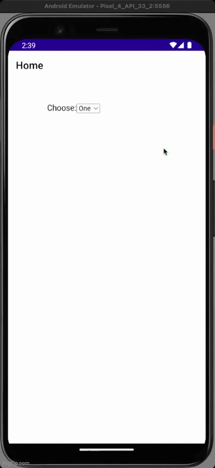

# 🐞 Bug Report: Dropdown in WebView Not Selectable on Android

## Description

When using a `<select>` dropdown inside a custom WebView (`SimpleHybridWebView`) in a .NET MAUI app on Android, the dropdown cannot be interacted with. Tapping the dropdown does not open the options list.

## Steps to Reproduce

1. Launch the app on an Android device or emulator.
2. Navigate to the page containing the custom WebView with a `<select>` dropdown.
3. Attempt to tap the dropdown to select an option.

## Expected Behavior

- Tapping the dropdown should open the list of options for selection.

## Actual Behavior

- Tapping the dropdown does **not** open the options list. The dropdown appears unresponsive.

## Environment

- **Platform:** Android
- **.NET MAUI Version:** [Your version here]
- **Device/Emulator:** [Device/Emulator name and API level]
- **Custom WebView:** `SimpleHybridWebView`

## Visual Evidence

Below is a GIF demonstrating the issue:

## Additional Notes

- The issue does not occur on [other platforms, if applicable].
- [Any other relevant information, logs, or error messages.] 